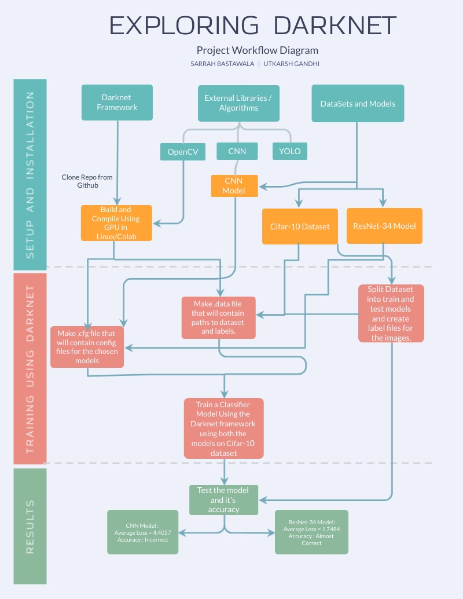
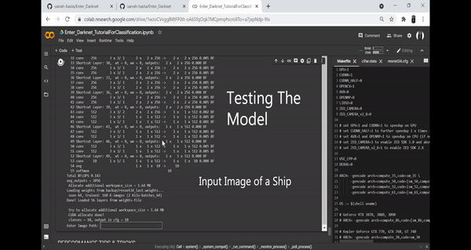

# ENTER DARKNET  
This blog is about our project in the Eklavya Mentorship Program by SRA VJTI.  
Here we have documented our journey through the world of Darknet and we hope that this will be a great starting point for others who wish to explore it!


###### Note: Editing skills are applied on images under professional guidance to make project seem cooler than it appears and should not be taken seriously

## About This Project

### Aim
The main aim of the project was to explore the darknet framework and its uses in deep learning and object detection, thereby applying our knowledge to the use of image classification using a CNN model.

### Domains Explored In This Project
* Deep Learning and Convolutional Neural Networks.
* Image Classification and Object Detection.
* Image Processing.
* Computer Vision.
  
### What Is Darknet ?
[Darknet](https://pjreddie.com/darknet/) is an open source neural network framework written in C and CUDA. Basically, we spent a total of six weeks researching and understanding about this framework, as compared to other more commonly known libraries such as Tensorflow and Keras, it is fast, easy to install, and supports CPU and GPU computation. Based on this blog, if you too would like to try tyour hand at using it for your AI expeditions, you can find the source on [GitHub](https://github.com/AlexeyAB/darknet).


The darknet framework has a variety of uses, the most prominent ones being object detection and image classification.  
It is used to classify images ImageNet challenge or to train a classifier on CIFAR-10 dataset.  

You only look once (YOLO) is a state-of-the-art, real-time object detection system which uses the darknet framework. Even though we don't use this a lot in our project, using some of the inbuilt config files in the darknet repo that include yolo, yolov2, the most commonly used used yolov3, and even yolov4, darknet makes magic come alive with as easy as a few clicks to train huge datsets and use it for a world of extremely accurate object detection.


## Approach
As mentioned above, we wanted to explore everything about darknet from scratch and hence we made a goal to effectively classify an image among the specified classes according to the provided data set, from scratch ! The proposed project consists of a model that is well researched and comprises various layers such as convolutional pooling and softmax.  
By using convolutional neural networks we make an effective trainable model using these layers and then supply it to the darknet frameowrk along with our data set and label files where we can train the model using deep learning. Once our model is effectively trained, it will be able to identify, distinguish and correctly label any image fed to it in its data. We chose classification over image detection as we wanted to try to be able to make our own config and data files, wheras the latter can be acomplished simple by the files already loaded in darknet's cfg folder. 


To train the model we pass a config file, a data file including the paths of our data set and labels to a darknet train command. We then use it to generate a weights file, which is passed along with the configured data file during the testing of any image and applies the correct values in the model. Once the model is trained and an image is passed on to it for testing, it classifies the image according to the output of its final softmax layer and prints the probability or percentage of the image being each of the given labels. We tested two models to do this and based the output of our project on the one that worked  better. We talk about our experiences with both models in detail later on.

## Workflow 


#### After a whole lot of research, some procrastination and taking full advantage of our teamwork, this is how we ended up going about our project from start-to-finish.
###### Of course, the mistakes that made us go about this path in loops and errors we googled are not recorded here ;) 


### Start where? Setup the Framework!
The first thing we did was to try to set up and install darknet in Linux.  
Now, if like one of the contributors on this project, Linux is not available for you as well, then setting it up in Google Colab, Windows or a virtual machine are also viable options. In fact, it was because 'said' contributor ended up working on Google Colab, that we now have an entire tutorial .pynb notebook set up for anyone who wishes to try this out for themselves (link comes a bit below, let's talk about the Linux route first).

### Choosing the Correct Dataset
Once we narrowed down that we wanted to try our hand at classification, we were then faced with choosing a suitable dataset. While the largest dataset containing 80 million images for 53,464 different nouns is TinyImages, we decided to with CIFAR-10, a subset of it, so we could test even inept models and run it without heavy computational power, in order to best study the framework.
#### CIFAR-10
The [CIFAR-10](https://www.cs.toronto.edu/~kriz/cifar.html) dataset consists of 60000 32x32 colour images in 10 classes, with 6000 images per class. There are 50000 training images and 10000 test images.


The dataset is divided into five training batches and one test batch, each with 10000 images. The test batch contains exactly 1000 randomly-selected images from each class. The training batches contain the remaining images in random order, but some training batches may contain more images from one class than another. Between them, the training batches contain exactly 5000 images from each class.

We will be using this dataset to train and test our models.

#### Downloading the dataset:

The python, MATLAB, and binary version can be downloaded from this [link](https://www.cs.toronto.edu/~kriz/cifar.html).

But since we are training through darknet, we used a mirror of the dataset as we wanted the pictures in image format.
Following instructions at this [link](https://pjreddie.com/darknet/train-cifar/) to do so.

We also made the cifar.data file in the cfg folder of the cloned darknet repository from the above, but since we will be using our own config files, we don't need the cifar_small.cfg file from the above link.

### Model(s) (Yes, we had to go through multiple)

### CNN Model
We created our own model for the CIFAR-10 dataset and use a config (.cfg) file of the
model to train the dataset. The image below shows our model. 
This model is inspired by the week 2 assignment in the course Convolutional Neural Networks by Andrew NG on Coursera. It is a very small and simple model for image classification. 
It consists of 2 convolutional layers and 2 max pooling layers and a connected layer. 
The last connected layer has 10 filters because we have 10 classes. This will give us our 10 predictions. We use a softmax to convert the predictions into a probability distribution.  
The accuracy of the model for classification of images is not that good as it is not complex or deep. We made this model to help us understand the working of a config file and to build our basics to make a better and more complex model.


### ResNet_34 Model

This model is inspired by the [Deep Residual Learning for Image Recognition](https://arxiv.org/pdf/1512.03385.pdf) research paper by Microsoft Research.

This image shows the 34-layer residual network we will be using for our model for image classification on the CIFAR-10 dataset. 
It is inspired by the ‘Deep Residual Learning for Image Recognition’ research paper written by Kaiming He, Xiangyu Zhang, Shaoqing Ren, and Jian Sun of Microsoft Research. 
Deep convolutional neural networks have achieved the human level image classification result. 
When the deeper network starts to converge, a degradation problem has been exposed: with the network depth increasing, accuracy gets saturated (which might be unsurprising) and then degrades rapidly.  
Such degradation is not caused by overfitting or by adding more layers to a deep network leads to higher training error.  The deterioration of training accuracy shows that not all systems are easy to optimize. To overcome this problem, Microsoft introduced a deep residual learning framework.  
Instead of hoping every few stacked layers directly fit a desired underlying mapping, they explicitly let these layers fit a residual mapping.   
Shortcut connections are those skipping one or more layers. The shortcut connections perform identity mapping, and their outputs are added to the outputs of the stacked layers.   
By using the residual network, there are many problems which can be solved such as: ResNets are easy to optimize, but the “plain” networks (that simply stack layers) show higher training error when the depth increases. 
ResNets can easily gain accuracy from greatly increased depth, producing results which are better than previous networks. Our model has 34 convolutional layers with one max pooling layer and multiple shortcuts.


### Training The Model

After making the cfg files, we are ready to train our models now using the CIFAR-10 dataset!

#### For training with the CNN Model

```
cd darknet
./darknet classifier train cfg/cifar.data cfg/CNN.cfg
```

#### For training with the ResNet Model

```
cd darknet
./darknet classifier train cfg/cifar.data cfg/ResNet_34.cfg
```

## Predicting

After training, we get a .weights file which stores the weights of the model.
Using this file we will now predict outputs.

#### To predict using the CNN Model

```
./darknet classifier predict cfg/cifar.data cfg/CNN.cfg backup/CNN_final.weights
```

#### To predict using the ResNet Model

```
./darknet classifier predict cfg/cifar.data cfg/ResNet_34.cfg backup/ResNet_34_final.weights
```
## Training Graphs

### CNN Model


###### That training graph enough should be an indication of why this model fails our purpose
 
```Average Loss = 4.4057```

### ResNet_34 Model


 
```Average Loss = 1.7484```
  
### Results

### CNN Model


###### But the output clearly shows us why we cannot use this model for classification

### ResNet_34 Model


## Future Prospects
Even though we have chosen an extremely small dataset and a simple training model keeping in mind our limited resources and computational power, while training from scratch, Darknet in itself is a high performance open source framework for the implementation of neural networks.
Advanced implementations of deep neural networks can be done using Darknet. These implementations include You Only Look Once (YOLO) for real-time object detection, ImageNet classification, recurrent neural networks (RNNs), and many others. We are now done exploring to our heart's content, and plan to use the complete potential of this framework paired with correct, suitable and deeper models. Some of our future prospects regarding this include:

- [ ] Image classification using better and more complicated models
- [ ] Use a bigger dataset for image classification (Eg. CIAR-1000).
- [ ] Object detection using darknet.
- [ ] Explore YOLO object detection system.

## Conclusion and Our Experiences
So, as your scrollbar indicates you have reached the end of our blog, we too reached the end of our first team college project under VJTI SRA, and boy was it a journey! Frpom discord bots never failing to ask for updates, to our seniors patiently assisting us in solving even the simplest of errors that drove us crazy (remember that contributor above? Let's just say someone almost gave up the project being stuck on a path error) Starting this, Deep Learning and Neural Networks were just fancy terms that we didn't even know, but we have come a long way from that [LA playlist](https://www.youtube.com/playlist?list=PLZHQObOWTQDPD3MizzM2xVFitgF8hE_ab) (Super helpful btw) to documenting this entire project in our [Github](https://github.com/Utkarsh2401/Enter_Darknet), complete with even a [Demo Video](https://drive.google.com/drive/u/0/folders/1vxSSL0lGeCrbcKH6cpRTMVrrhzCC17ZA) . 



Not only that, we even came up with this [How to train a Classifier on Cifar-10 using Darknet on Colab notebook using a Resnet model's config file](https://colab.research.google.com/drive/1wzoCVvgglMtFPiXt-oA6SfqOqk7MCpmq) Tutorial Notebook, to save you a whole lot of googling and quite a few caffiene-filled nights of frustration, and hopefully ignite a small spark that can help you start your jouney in ML.  

## Contributors
* [Utkarsh Gandhi](https://github.com/Utkarsh2401)
* [Sarrah Bastawala](https://github.com/sarrah-basta)

## Acknowledgements 

* [SRA VJTI](https://sravjti.in/) Eklavya 2021
* [Project Drive](https://drive.google.com/drive/u/1/folders/1RWdPRY5_vRV82a5bEDPjy3V8FqGq6T5Z)
* Speacial thanks to our mentors [Aman Chhaparia](https://github.com/amanchhaparia) and [Prathamesh Tagore](https://github.com/meshtag) and to the whole SRA Team for guiding us throughout this project.

## Resources
* [pjreddie](https://pjreddie.com/)
* [AlexeyAB](https://github.com/AlexeyAB/darknet)
* [Deep Residual Learning for Image Recognition - Miscrosoft Research Paper](https://arxiv.org/pdf/1512.03385.pdf)
* [Project Drive Link](https://drive.google.com/drive/u/0/folders/1RWdPRY5_vRV82a5bEDPjy3V8FqGq6T5Z)
* [Our Github Repo](https://github.com/Utkarsh2401/Enter_Darknet)
* [Self-Made Tutorial Notebook](https://colab.research.google.com/drive/1wzoCVvgglMtFPiXt-oA6SfqOqk7MCpmq)
* [Project Report](https://github.com/sarrah-basta/Enter_Darknet/blob/main/Assets/Enter_Darknet_Report.pdf)
* [The Theory Behind the Project](https://www.coursera.org/specializations/deep-learning)
* [Dataset](https://www.cs.toronto.edu/~kriz/cifar.html)
* [Demo Video](https://drive.google.com/drive/u/0/folders/1vxSSL0lGeCrbcKH6cpRTMVrrhzCC17ZA)
